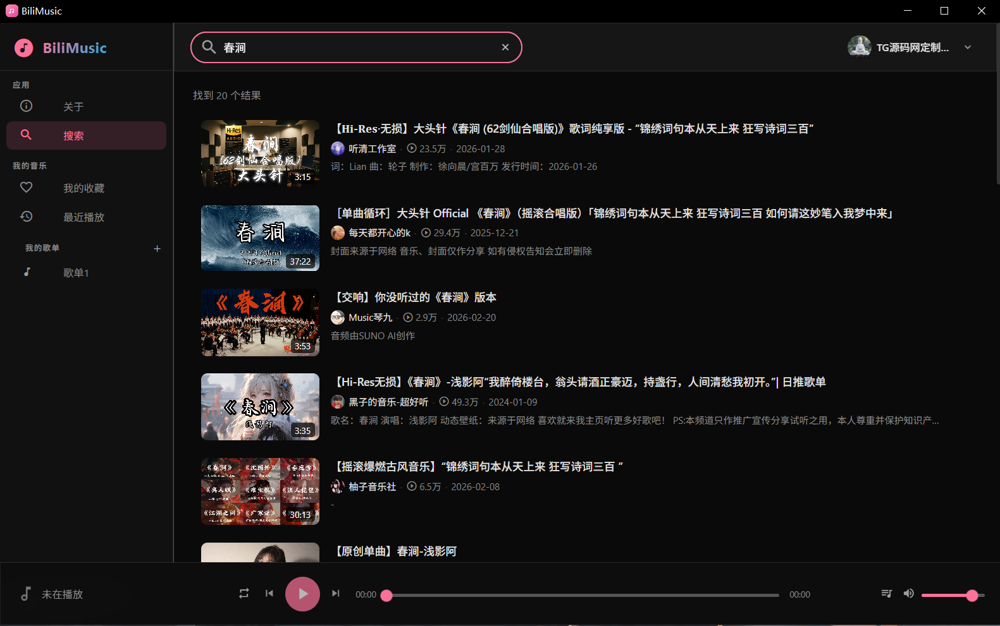
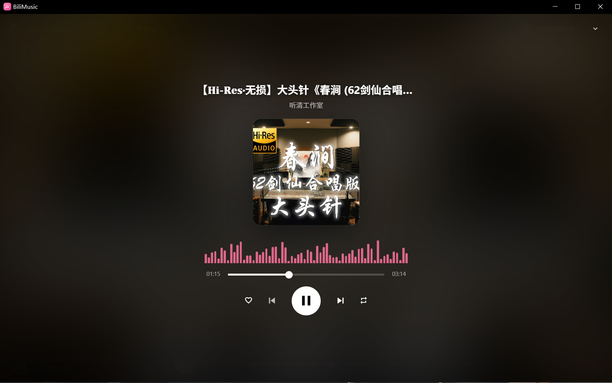
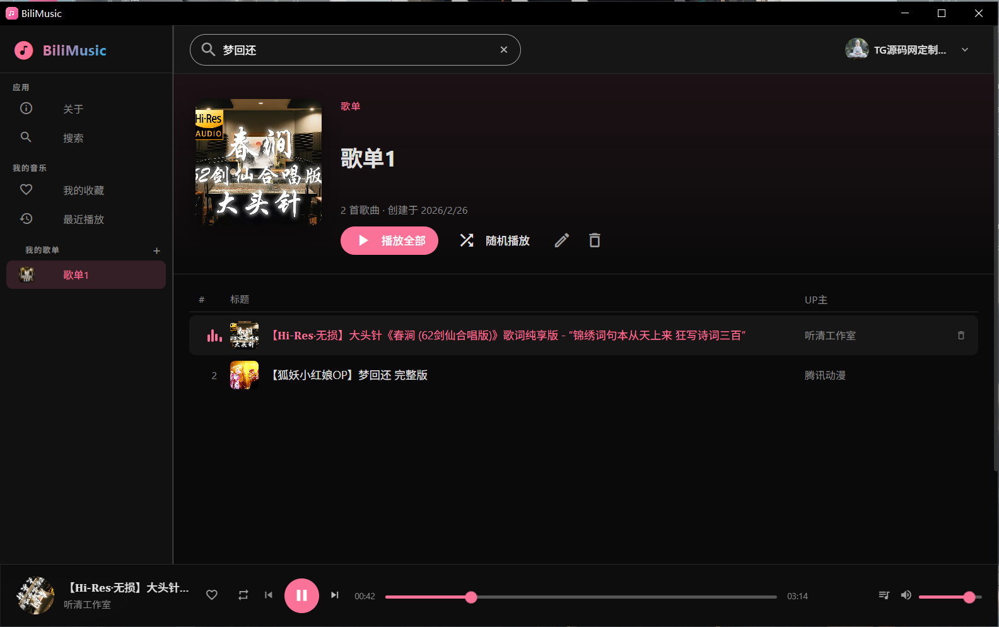
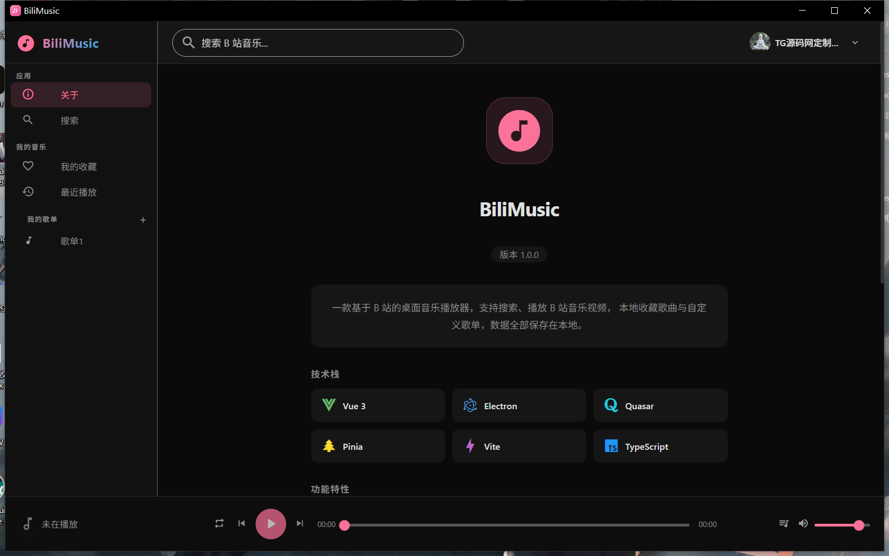

# BiliMusic 🎵

<p align="center">
  
</p>

<p align="center">
  基于哔哩哔哩（B 站）公开接口的跨平台桌面音乐播放器 🎧🎶
</p>

<p align="center">
  <strong>⚠️ 非官方项目，与哔哩哔哩无任何官方关联或背书</strong>
</p>

<p align="center">
  本项目由 <a href="https://tgymw.net"><strong>TG源码网</strong></a> 原创开发，官网：<a href="https://tgymw.net">https://tgymw.net</a><br/>
  ⛔ 本项目禁止用于任何商业用途
</p>


<p align="center">
  <a href="https://tgymw.net">官网</a> ·
  <a href="https://github.com/tgymwnet/bili-music/releases/latest">下载</a> ·
  <a href="https://github.com/tgymwnet/bili-music/issues">反馈</a>
</p>

<p align="center">
  
  
  
  
</p>

---

## 📸 截图

| 搜索播放 | 正在播放 |
|---------|---------|
|  |  |

| 自定义歌单 | 关于页面 |
|-----------|---------|
|  |  |

---

## ✨ 特色功能

- 🔍 **搜索播放** — 搜索并播放 B 站音乐视频，支持 WBI 签名
- 🎧 **高品质音频** — 优先拉取高码率音频流，支持 HTML5 与 DASH 格式
- ❤️ **本地收藏** — 收藏歌曲、创建自定义歌单，数据全部保存在本地
- 📋 **播放队列** — 灵活管理播放列表，支持顺序 / 随机 / 单曲循环
- 💿 **沉浸式播放** — 全屏展示面板，模糊封面背景 + 音频可视化
- 🔐 **扫码登录** — 扫码登录 B 站账号，有效避免 412 风控
- 🖥️ **系统托盘** — 关闭窗口可选后台运行，托盘控制播放
- ⏯️ **任务栏控制** — Windows 任务栏缩略图按钮快速切歌 / 暂停
- 🌙 **深色主题** — 精心设计的暗色 UI，长时间使用不疲劳
- 🚀 **纯前端架构** — 无需后端服务，Electron 本地代理解决跨域

---

## 🛠️ 技术栈

| 技术 | 用途 |
|------|------|
| [Vue 3](https://vuejs.org/) | 前端框架 |
| [Electron](https://www.electronjs.org/) | 桌面端跨平台 |
| [Quasar](https://quasar.dev/) | UI 组件库 |
| [Pinia](https://pinia.vuejs.org/) | 状态管理 |
| [Vite](https://vitejs.dev/) | 构建工具 |
| [TypeScript](https://www.typescriptlang.org/) | 类型安全 |
| [Howler.js](https://howlerjs.com/) | 音频播放引擎 |
| [Axios](https://axios-http.com/) | HTTP 请求 |

---

## 📥 下载和使用

### 下载

前往 [Releases](https://github.com/tgymwnet/bili-music/releases/latest) 页面下载：

| 平台 | 文件 | 说明 |
|------|------|------|
| Windows | `BiliMusic Setup x.x.x.exe` | 安装版（推荐） |
| Windows | `release/win-unpacked/` | 免安装版，解压即用 |

### 系统要求

- **Windows** 10 / 11（x64）
- **Node.js** 18+ 或 20+（仅开发/编译需要）

---

## 🚀 部署与开发

### 环境要求

- **Node.js** 18+ 或 20+（推荐 20.x LTS）
- **npm** 8+
- **Git**（用于克隆仓库）

### 1. 克隆仓库

```bash
git clone https://github.com/tgymwnet/bili-music.git
cd bili-music
```

### 2. 安装依赖

```bash
# 使用国内镜像加速（推荐）
npm install --registry https://registry.npmmirror.com

# 或直接安装（如果仓库已包含 node_modules 则跳过此步）
npm install
```

### 3. 开发者模式运行

```bash
npm run electron:dev
```

启动后会自动打开 Electron 窗口，代码修改后 HMR 热更新。

### 4. 编译桌面端

#### Windows

```bash
npm run electron:build
```

编译产物在 `release/` 目录：

| 文件 | 说明 |
|------|------|
| `BiliMusic Setup 1.0.0.exe` | Windows 安装版（推荐） |
| `win-unpacked/BiliMusic.exe` | Windows 免安装版 |

#### macOS

```bash
# 在 macOS 系统上执行
npm run electron:build
```

> macOS 打包需要在 macOS 环境下运行，交叉编译不受支持。  
> 产物为 `release/BiliMusic-1.0.0.dmg`（DMG 安装包）。  
> 如需签名，需配置 Apple Developer 证书。

#### 仅构建前端（不打包 Electron）

```bash
npm run build
```

### 5. 其他命令

```bash
npm run dev          # 仅启动 Vite（Web 模式，无 Electron）
npm run gen-icon     # 生成应用图标（编译时自动执行）
```

---

## 🗑️ 数据管理

应用数据全部保存在本地，不上传至任何服务器。

### 本地存储内容

| 数据 | 存储键 | 说明 |
|------|--------|------|
| B站登录信息 | `bilimusic_user` | 头像、昵称、UID |
| 收藏歌曲 | `bili-music:favorites` | 收藏列表 |
| 自定义歌单 | `bili-music:library` | 歌单及歌曲 |
| 播放记录 | `bili-music:playlist` | 最近播放队列 |
| 登录凭证 | Electron Session Cookies | SESSDATA 等 |

### 清除所有数据

删除 Electron 用户数据目录（彻底清除）

```bash
# Windows (PowerShell)
Remove-Item -Recurse -Force "$env:APPDATA\bilimusic"

# macOS
rm -rf ~/Library/Application\ Support/bilimusic

```

---

## 📁 项目结构

```
bili-music/
├── electron/              # Electron 主进程
│   ├── main.cjs           # 主进程入口（代理服务器、窗口管理、托盘）
│   ├── preload.cjs        # 预加载脚本（IPC 桥接）
│   ├── dev.cjs            # 开发启动脚本
│   └── gen-icon.cjs       # 图标生成工具
├── src/
│   ├── api/               # B 站 API 封装
│   ├── components/        # Vue 组件
│   ├── layouts/           # 布局组件
│   ├── pages/             # 页面
│   ├── stores/            # Pinia 状态管理
│   ├── utils/             # 工具函数（WBI 签名等）
│   ├── css/               # 全局样式
│   └── main.ts            # 渲染进程入口
├── package.json
├── vite.config.ts
└── tsconfig.json
```

---

## 📄 许可证

本项目以 **[PolyForm Noncommercial License 1.0.0](LICENSE)**（非商业许可）发布，**禁止任何商业用途**。

详情参见 [LICENSE](LICENSE)（SPDX：`PolyForm-Noncommercial-1.0.0`）。

---

## ⚖️ 法律声明与使用限制

- 本项目仅供 **学习与研究使用**，**禁止任何形式的商业用途**（包括但不限于销售、收费服务、广告变现、商业集成等）。
- 本项目与 **Bilibili 无任何官方关联或背书**，不使用其商标与标识；涉及的名称与商标归其权利人所有。
- 数据来源于用户调用的公开接口与个人账户授权；使用时需遵守 Bilibili 的《用户协议》《社区规则》及相关法律法规。
- 禁止绕过登录/会员权限、DRM/加密措施，或进行批量爬取、恶意抓取等违反平台规则的行为。
- 如涉及权利或合规问题，请通过 [Issues](https://github.com/tgymwnet/bili-music/issues) 反馈以便及时处理。

---

## 🙏 鸣谢

- [SocialSisterYi/bilibili-API-collect](https://github.com/SocialSisterYi/bilibili-API-collect) — B 站 API 文档整理
- [wood3n/biu](https://github.com/wood3n/biu) — 项目灵感来源

---

## 👨‍💻 开发者

由 **[TG源码网](https://tgymw.net)** 原创开发

---

如果你喜欢这个项目，欢迎 ⭐ Star 支持！也欢迎提出 Issue 交流与反馈 🙌
